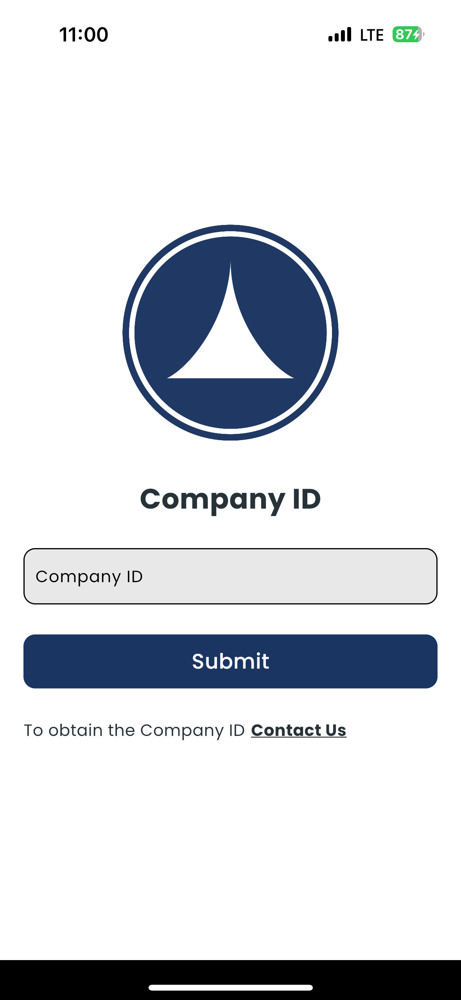
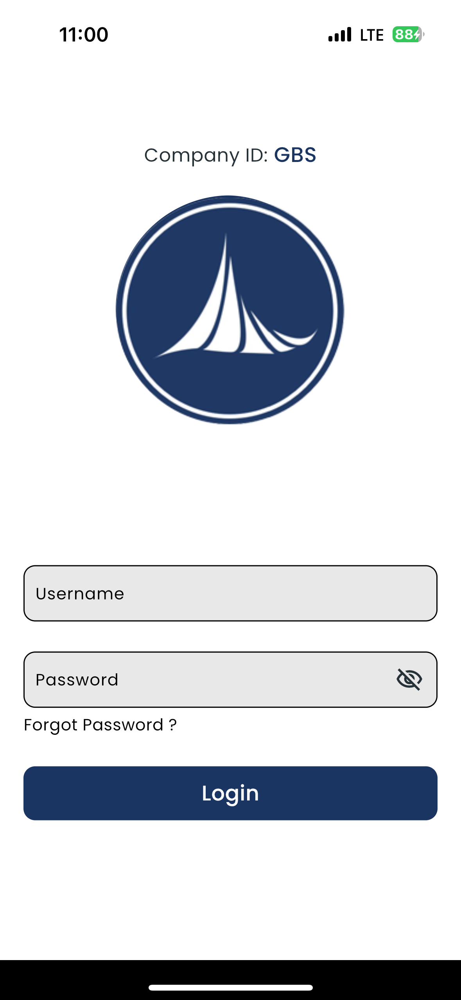

# Flutter Interview Project

This project is designed to assess your skills in Flutter development, specifically focusing on API integration and UI implementation.

## Instructions

You will be creating a Flutter application that interacts with the provided backend APIs. The application will consist of two main screens:
- **Company Screen**
- **Login Screen**

### API Endpoints

1. **Get Company Data**
   - **URL**: `https://fe-interview-be.fe-interview.workers.dev/company/{code}`
   - **Method**: GET
   - **Description**: Retrieves data for a specific company identified by `{code}`.

2. **Login**
   - **URL**: Use the `ipAddress` from the company data to form the login URL.
   - **Endpoint**: `/login`
   - **Method**: POST
   - **Description**: Authenticates the user using their username and password.

### Steps

1. **Company Screen**
   - Make a GET request to `https://fe-interview-be.fe-interview.workers.dev/company/gbs` to retrieve company details.

2. **Login Screen**
   - After successfully retrieving the company details, navigate to the Login screen.
   - Use the `ipAddress` from the company details to make a POST request to the `/login` endpoint.
   - Authenticate the user using the provided credentials and display their details upon successful login.

### Credentials

- **Company Code**: `gbs`
- **Username**: `user1` 
- **Password**: `password1`
- **OR**
- **Username**: `user2`
- **Password**: `password2`

### Requirements

- You are free to use any libraries for state management, network requests, etc.
- Follow the provided UI mockups for the design of the screens.
- Handle errors gracefully and provide meaningful feedback to the user.

### Mockups

Include screenshots or links to the mockup images for the Company and Login screens here.

### Submission

1. Fork this repository.
2. Clone your forked repository to your local machine.
3. Implement the project as described.
4. Push your changes to your forked repository.
5. Create a pull request to the original repository.

Good luck, and happy coding!
